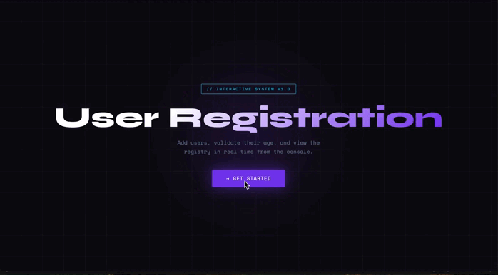

# 💻 ★⋆｡ °⋆     Interactive Systems

> Single-page promotional website for the rock band **Shattered Riffs** and their *Rock the Night Tour 2026*. Built with plain HTML, CSS, and a minimal amount of vanilla JavaScript. No frameworks, no build tools, no dependencies.

Live at: https://vreniz.github.io/rock-band/
---

---

## Overview

Shattered Riffs is a fully static, single-page site. The design system is driven by CSS custom properties declared once in `:root` and referenced throughout. Every interactive element — the mobile menu, the album flip cards, the gallery hover effects — is powered by CSS alone. JavaScript handles only two small behaviours that CSS cannot achieve on its own.

---

## 🛠️ Technologies Used

 &nbsp;
 &nbsp;

- **HTML5** — Semantic structure with ARIA accessibility attributes
- **CSS3** — Custom properties, Flexbox, Grid, CSS transitions, responsive media queries
- **JavaScript ES6+** — Vanilla, no frameworks or libraries
- 🔤 [Google Fonts](https://fonts.google.com/) 

## DEMO

